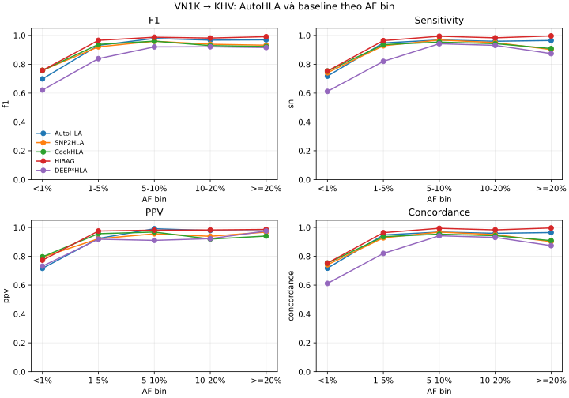

# VN1K → KHV — kết quả tham chiếu

Nguồn số: [`summary_by_af_bin.csv`](summary_by_af_bin.csv) và
[`summary_by_rare_af_bin.csv`](summary_by_rare_af_bin.csv). Đây là một external
fold (`fold91`), không phải 10 external folds.



## Protocol

| mục | giá trị |
|---|---:|
| train / test | 946 / 99 mẫu |
| marker | 5.032 |
| seed | 77 |
| validation nội bộ | 5% train |
| post-hoc | 10-fold |
| arm | AutoHLA base, pair off |
| nhãn | G-group |

## F1 theo AF bin

`sn` và concordance là micro. `f1` giữ công thức của evaluator lịch sử:
trung bình theo allele, trọng số là số bản sao thật. Không đổi công thức khi đối
chiếu với kết quả cũ.

| AF bin | AutoHLA | SNP2HLA | CookHLA | HIBAG | DEEP*HLA |
|---|---:|---:|---:|---:|---:|
| `<1%` | **0.698562** | 0.757841 | 0.757516 | 0.757766 | 0.621345 |
| `1-5%` | 0.931089 | 0.920821 | 0.937537 | **0.965872** | 0.839086 |
| `5-10%` | 0.979153 | 0.959741 | 0.960228 | **0.987506** | 0.920398 |
| `10-20%` | 0.967344 | 0.938812 | 0.929230 | **0.981858** | 0.921182 |
| `>=20%` | 0.969456 | 0.932008 | 0.923041 | **0.991315** | 0.916087 |

AutoHLA đạt F1 `<1%` cao nhất trong các arm AutoHLA đã chạy cục bộ; arm `pair`
không phải release vì đạt 0.696732 ở cùng bin. `autohla_freq` được train sau đó
nhưng chỉ đạt 0.681699, nên không dùng.

## Tái tạo

Xem [README](../../README.md), chạy `tools/run_cv.py`, sau đó pool và score bằng
`scripts/eval/cv10_canonical_metrics.py`. Kiểm hash trước khi chạy:

```bash
sha256sum -c protocol/vn1k_khv.sha256
```

Kết quả chi tiết hiếm kiểu CookHLA nằm trong
[`summary_by_rare_af_bin.csv`](summary_by_rare_af_bin.csv).
